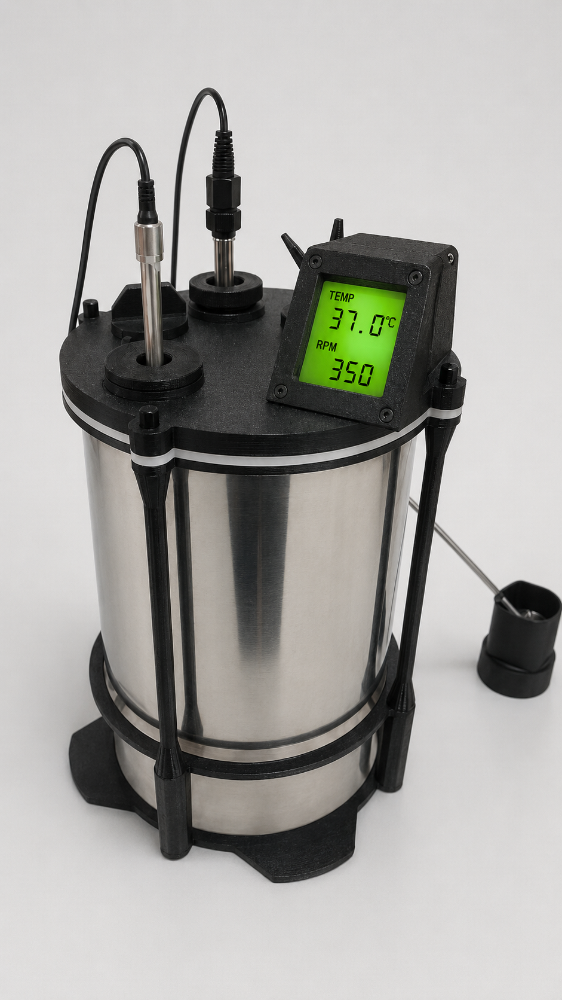
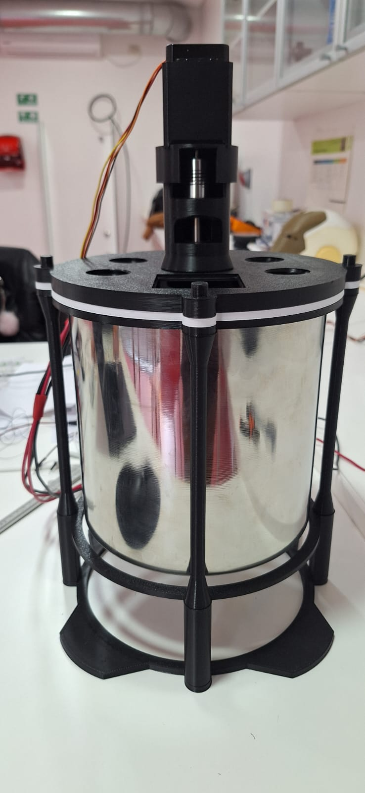

# CREATIBIO - Bioprocesos y Producción Biotecnológica

Repositorio correspondiente a la línea de Bioprocesos y Producción Biotecnológica de CREATIBIO.

Esta línea se enfoca en el desarrollo de sistemas de cultivo, fermentación, automatización y producción biológica con fines educativos y tecnológicos.

## Proyectos

### Biorreactor educativo automatizado
Diseño y construcción de un biorreactor modular para enseñanza y experimentación.

#### Prototipo proyectado

##### Estado de avance actual real

### Producción de proteínas recombinantes
Línea proyectada para expresión y purificación de proteínas de interés biotecnológico.

## Contenido del repositorio

- Diseños 3D
- Electrónica y firmware
- Protocolos experimentales
- Documentación técnica
- Presentaciones y material de apoyo

## Organización

Responsable de línea: Cecilia Sanmartín

CREATIBIO – IUDPT
